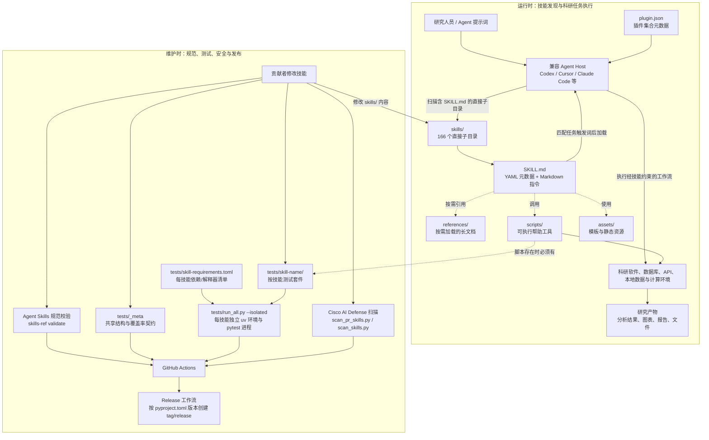

# Scientific Agent Skills 架构说明

## 1. 项目定位

Scientific Agent Skills 是一个面向科研任务的 **Agent Skills 集合**，而不是提供单一服务的 Python 应用。每个技能是一个可独立发现、按需加载的知识与工具包，描述某个科研软件包、数据库、平台或研究工作流的适用条件、操作步骤、示例、科学约束与可选脚本。

仓库根目录同时是符合 Agent Plugins 1.0.0 的插件包。`plugin.json` 负责集合级元数据；兼容客户端从 `skills/` 的直接子目录中发现含有 `SKILL.md` 的技能。当前工作区有 166 个技能；集合版本为 `2.69.0`，并要求 `plugin.json` 与 `pyproject.toml` 的版本保持一致。

## 2. 二维架构图



实线表示主要调用或依赖关系，虚线表示可选的按需内容或仓库约束。运行时与维护时通过 `skills/<name>/` 相接：前者消费技能包，后者保证技能包可发现、可验证且可测试。

## 3. 目录与职责

| 路径 | 职责 | 运行时是否被 Agent 直接消费 |
| --- | --- | --- |
| `plugin.json` | Agent Plugins 包清单、名称、版本、描述和作者 | 是，插件客户端读取 |
| `skills/<name>/SKILL.md` | 每项技能的必需入口：前置元数据、触发词、工作流、示例、限制 | 是 |
| `skills/<name>/references/` | 过长或细分的参考资料，避免主技能文件过大 | 按需 |
| `skills/<name>/scripts/` | 可复用的 CLI、校验器或工作流工具 | 按需执行 |
| `skills/<name>/assets/` | 模板、静态资源、示例辅助文件 | 按需 |
| `skills/literature-archive/` | 可配置的长期文献归档：OpenAlex/Europe PMC 检索、标识符去重、OA PDF 校验下载、本地 SQLite 审计记录 | 是，按需 |
| `skills/literature-method-extraction/` | 在本地归档之上提取 Europe PMC 开放 JATS 全文的分析方法证据，提供 CLI、CSV 导出和本地复核 GUI | 是，按需 |
| `tests/<name>/` | 与技能同名的脚本行为测试及 fixtures；不进入技能包 | 否 |
| `tests/_contract/` | 共享的结构、CLI、办公文档等测试工具 | 否 |
| `tests/_meta/` | 跨所有技能的仓库级结构与覆盖率守卫 | 否 |
| `tests/skill-requirements.toml` | 各技能独立测试环境的 Python 版本和依赖声明 | 否 |
| `scripts/generate_skill_image.py` | 从完成的技能文档生成可选流程图到 `docs/images/` | 否 |
| `scan_skills.py` / `scan_pr_skills.py` | 全量/PR 增量的技能安全扫描及报告生成 | 否 |
| `.github/workflows/` | 规范校验、测试、安全扫描、发布的 CI 自动化 | 否 |
| `docs/` | 说明、示例、安全报告与可选技能流程图 | 否 |

## 4. 单个技能的内部契约

技能目录名必须等于 `SKILL.md` 前置元数据中的 `name`。`SKILL.md` 使用 Agent Skills 标准规定的封闭顶级字段集：`name`、`description`、`license`、`compatibility`、`allowed-tools`、`metadata`。本仓库额外要求 `metadata.version` 存在且为带引号的字符串。

典型层次如下：

```text
skills/<skill-name>/
├── SKILL.md              # 必需；从简短触发描述逐步展开到工作流与示例
├── references/           # 可选；只在需要细节时读取
├── scripts/              # 可选；避免重复实现脆弱或复杂逻辑
└── assets/               # 可选；模板和静态资源

tests/<skill-name>/       # 仅当技能有 scripts/ 时必须存在
├── test_scripts.py
└── fixtures/             # 可选测试数据
```

这种分层使客户端初始只需读取技能描述与主体；详细文档、脚本和资源只有在任务确实需要时才被加载或执行。`skills/` 内禁止放测试、fixtures、临时数据和生成输出，避免把维护材料混入代理的可加载上下文。

## 5. 运行时工作流

1. 用户在兼容 Agent Host 中安装整个插件或某个技能，并提出科研任务。
2. Host 根据已配置的技能路径和每个 `SKILL.md` 的名称、描述、触发词发现相关技能。
3. Agent 读取技能主体，确认环境、网络、凭据、科学边界和验证要求；仅在需要时读取 `references/`。
4. Agent 依照工作流调用已安装的软件包、数据库/API 或技能提供的 `scripts/`，处理用户已授权的数据。
5. Agent 输出分析结果，并保留技能要求的质量检查、来源、局限性和人工复核边界。

技能本身不替代底层软件、数据库账户或计算资源。某些技能需要额外 Python 包、系统二进制、网络访问、API 密钥或特定硬件；实际要求由目标技能的 `compatibility`、安装段和引用资料决定。

## 6. 质量与安全架构

### 长期文献归档扩展

`literature-archive` 将“定期检索”明确放在技能脚本和仓库外运行数据之间：JSON 配置描述主题、来源、结果上限和本地路径；脚本将运行记录、检索计数、来源记录、去重后的元数据及下载状态写入 SQLite，把 PDF 写入单独目录。它使用 DOI、PMID、PMCID、arXiv ID 等稳定标识优先去重，并以锁文件防止调度器的并发运行。

该扩展不是一个常驻云服务。cron 或 systemd timer 等宿主调度器负责触发；OpenAlex 和 Europe PMC 负责文献发现；仅 OpenAlex 或可选 Unpaywall 明确给出的开放获取 PDF URL 才会下载。下载前检查 HTTP(S) 地址、响应内容类型、文件头和配置的字节上限，失败状态保存在数据库中而不会把 HTML 错页当作 PDF 归档。

其下游 `literature-method-extraction` 是面向同事交付的应用层：CLI 编排“归档 -> JATS Methods 获取 -> 词法证据提取 -> CSV 导出”，本地 Web GUI 则只启动该 CLI、读取 SQLite、展示方法证据和保存复核状态。GUI 仅监听 `127.0.0.1`，不将论文或本地数据库暴露成网络服务。JATS 缺失时记录 `unavailable`，不会从摘要或 PDF 元数据臆测方法。

### 规范和结构

`skills-ref validate` 逐项校验 Agent Skills 规范，例如目录名与 `name` 一致、前置元数据字段合法、描述长度和 YAML 格式正确。`tests/_meta` 再执行仓库专有约束：本地链接可解析、`SKILL.md` 行数、脚本可解析、无危险的动态执行模式、无硬编码本地路径、插件清单闭合集与版本同步等。

### 测试隔离

科研技能的上游依赖常互相冲突。例如某些技能需要不同的 Python、NumPy、Transformers 或 Zarr 版本。因此 `tests/run_all.py --isolated <name>` 为每个技能构造独立的临时 `uv` 环境，并且每个技能使用单独的 pytest 进程。这样也避免多个技能中的同名脚本辅助模块在同一个 Python 解释器中相互覆盖。

仓库级契约不导入技能代码，因而可快速跨全部技能运行。每个有 `scripts/` 的技能必须有对应 `tests/<name>/` 与 `tests/skill-requirements.toml` 条目；CLI 脚本至少需要能响应 `--help`，在隔离环境中再执行真实依赖下的测试。

### 安全扫描

PR 修改技能内容时，CI 对受影响技能执行 Cisco AI Defense Skill Scanner，并在高危及以上发现时阻断。`scan_skills.py` 用于定期全库扫描：它对未变更技能复用上次报告的结果，并在扫描器/模型变化或超过最长时限时触发全量扫描。扫描报告属于风险信号，不等同于安全认证；发现需要结合实际文件和上下文复核。

### 发布

当 `pyproject.toml` 的版本变更进入 `main` 时，发布工作流从该文件读取版本，创建 `v<version>` 标签和 GitHub Release。修改集合版本时必须同步更新 `plugin.json`。
