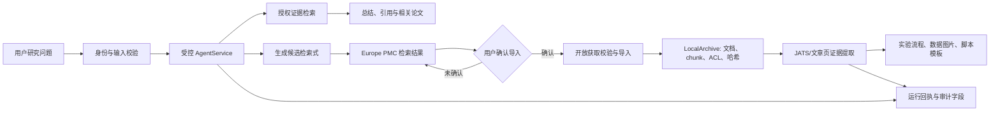

# 国内 Agent 开发工程师求职与面试手册（目标年薪 30-40 万）

> 更新：2026-09-21。本文只面向中国大陆的 `AI Agent 工程师`、`智能体工程师`、`Agent 开发工程师`岗位。RAG、MCP、模型调用和后端工程仅作为 Agent 开发的组成能力出现，不作为独立求职方向。
>
> 薪资以税前年固定现金为主：`月固定薪资 x 固定发薪月数`。股票、期权、浮动年终、补贴和试用期折扣必须单列核验，不能直接计入 30-40 万目标。

## 1. 岗位检索与筛选

### 只使用这些岗位搜索词

- `AI Agent 工程师`
- `智能体工程师`
- `Agent 开发工程师`
- `Agent 平台工程师`
- `多智能体工程师`
- `智能体应用开发`
- `智能体系统工程师`

职位标题不含 Agent 时，不把它纳入本轮投递目标。JD 至少应明确包含工具调用、工作流/编排、Agent 评测、MCP、记忆、自治任务、Agent 平台或智能体产品中的两项。

### 实时职位入口

招聘页会变化，以下是实时入口而非静态职位清单。每周搜一次，并将合格 JD 保存到表格。

- [BOSS 直聘：AI Agent](https://www.zhipin.com/web/geek/job?query=AI%20Agent)
- [猎聘：AI Agent](https://www.liepin.com/zhaopin/?key=AI%20Agent)
- [拉勾：AI Agent](https://www.lagou.com/wn/jobs?kd=AI%20Agent)
- [智联招聘：AI Agent](https://sou.zhaopin.com/?jl=全国&kw=AI%20Agent)

按目标城市分别检索 `AI Agent`、`智能体工程师` 和 `Agent 开发`。筛选时记录公司、城市、固定月薪、固定月数、职责、所需技术、是否有真实产品交付、面试阶段和投递日期。

### 30-40 万筛选规则

| 固定月薪 | 固定月数 | 年固定现金 | 是否进入目标池 |
| --- | ---: | ---: | --- |
| 25k | 12 | 30 万 | 是，需确认年终是否另算 |
| 25k | 13 | 32.5 万 | 是 |
| 28k | 13 | 36.4 万 | 是 |
| 30k | 13 | 39 万 | 是 |
| 30k | 14 | 42 万 | 视职责与强度决定 |

向 HR 必问：固定月数是否写入 offer、年终是否保证、试用期薪资、社保公积金基数、加班制度、股票是否被计入“总包”、团队负责的是产品研发还是售前交付。

### 面经与视频检索入口

经验贴只能用于收集题目和流程，答案必须回到项目实践和官方资料验证。

- [牛客：AI Agent 面经](https://www.nowcoder.com/search?type=all&query=AI%20Agent%20%E9%9D%A2%E7%BB%8F)
- [知乎：AI Agent 面试](https://www.zhihu.com/search?type=content&q=AI%20Agent%20%E9%9D%A2%E8%AF%95)
- [CSDN：Agent 面试](https://so.csdn.net/so/search?q=Agent%20%E9%9D%A2%E8%AF%95)
- [Bilibili：AI Agent 面试](https://search.bilibili.com/all?keyword=AI%20Agent%20%E9%9D%A2%E8%AF%95)
- [Bilibili：MCP、RAG、Agent 面试](https://search.bilibili.com/all?keyword=RAG%20MCP%20Agent%20%E9%9D%A2%E8%AF%95)

## 2. Agent 工程师能力地图

一个合格的 Agent 工程师不是“会调用模型 API”，而是能交付一个可控的行动型系统。

```text
用户请求
  -> 鉴权、输入校验、任务状态
  -> Agent 路由/计划/工作流图
  -> 模型推理 + 检索 + 受限工具调用
  -> 审批、重试、终止、错误恢复
  -> 结果、引用、审计日志、评测与监控
```

### 必须掌握

1. Python、HTTP、异步 I/O、SQL、Redis、任务队列、Docker、Git 和 Linux。
2. 模型消息协议、结构化输出、function/tool calling、流式输出、上下文窗口、重试和限流。
3. Agent 状态、计划、工具选择、状态机/图编排、短期与长期记忆、终止条件和人工审批。
4. MCP/OpenAPI/企业 API 接入，认证、最小权限、幂等、审计和副作用控制。
5. RAG 作为 Agent 的知识工具：解析、检索、重排、ACL、引用和拒答。
6. 离线评测、线上 tracing、成本/延迟、灰度发布、回滚和安全测试。

### 你需要拿得出手的作品集

你的 `scientific-agent-skills` 项目应展示成“Agent 能力工程”，不是“安装了一套提示词”。

- **能力模块化**：skill 将触发条件、SOP、脚本、资产、依赖和版本拆开管理。
- **工具可控**：`literature-archive` 将检索、去重、开放 PDF 校验和 SQLite 审计变成确定性 CLI，而不是让模型自由抓网页。
- **组合工作流**：文献归档 -> 方法提取 -> SQLite/CSV -> 本地复核 GUI；说明每一段的输入输出契约。
- **可靠性**：dry-run、配置校验、锁文件、失败状态记录、测试和隔离环境。
- **安全**：密钥与配置分离，外部文本视为数据，开放获取与下载边界明确。

### 90 秒自我介绍模板

“我目标是 Agent 开发工程师，关注把模型能力落成可控、可评测、可维护的行动系统。近期我围绕科研工作流开发了 skill 驱动的 Agent 能力模块：用标准化元数据做发现和路由，把可重复操作固化成可配置 CLI，并以测试、依赖隔离、版本和来源记录保证复现。以 `literature-archive` 为例，我没有让模型直接抓取网页，而是把允许数据源、开放获取校验、稳定标识去重、SQLite 审计、失败记录和调度互斥做成确定性流程。我的重点是 Agent 的工具可靠性、工作流状态、评测、可观测性和安全边界。”

## 3. 回答方法

每一道题按：**结论 -> 机制 -> 工程取舍 -> 真实项目证据** 回答。没有实践过的内容要说“我会如何验证”，不要伪装成线上经验。

例如，不要只说“我熟悉 LangGraph”。要说：“我会把审批、重试和终止点显式建成状态节点；模型只在受限分支里做决策，副作用工具经过 schema 校验、幂等和人工确认。因此 trace 和失败恢复都可观察。”

## 4. 高频面试题与参考回答

### A. Agent 基础与编排（1-12）

| # | 问题 | 参考回答 |
| ---: | --- | --- |
| 1 | 什么是 Agent？ | Agent 是模型在受限环境中根据状态选择动作、调用工具、观察结果并终止的应用结构。核心不是多轮聊天，而是状态、动作空间、工具约束和可验证产物。 |
| 2 | Agent、聊天、RAG、工作流的边界？ | 聊天重生成；RAG 重检索证据；工作流重预定义步骤；Agent 允许模型在受控范围内选择工具或分支。固定流程优先工作流。 |
| 3 | 什么时候不该用 Agent？ | 步骤固定、结果必须严格复现、风险高、工具少或模型决策不增益时。例如 ETL、结算、删除数据，应使用确定性服务。 |
| 4 | 单 Agent、图工作流、多 Agent 如何选？ | 默认单 Agent 或图。图适合审批、并行、重试和显式状态；多 Agent 仅在角色天然分工、产物可验证、上下文隔离有价值时使用。 |
| 5 | ReAct 的优缺点？ | 推理-行动-观察闭环简单，适合探索任务；但循环不稳定、轨迹长、成本高、难复现。生产中要结构化动作、限制步数、记录状态。 |
| 6 | planning 怎么落地？ | 计划应是数据结构，带目标、依赖、工具、成功条件和状态；执行结果可以触发重规划。固定子流程写代码，不要每轮让模型重想。 |
| 7 | Agent state 包含什么？ | 任务/用户/租户 ID、目标、计划、步骤数、工具结果引用、批准动作、错误、预算、最终状态与版本。大文件存外部，state 只存 ID/摘要。 |
| 8 | 终止条件如何定义？ | 定义成功、失败、取消、预算耗尽；还要有最大步骤、最大成本、deadline 与重复 state 检测。成功由可验证产物决定。 |
| 9 | 如何处理工具失败？ | 网络/限流可退避；schema 错误可给模型一次结构化修正；权限、危险操作和业务冲突直接停或转人工。每个工具都有超时、重试、幂等策略。 |
| 10 | 如何防止死循环？ | 总步骤/成本上限、同工具重试上限、state hash、节点 deadline、无进展即澄清或转人工。日志需说明停止原因。 |
| 11 | HITL 放在哪？ | 不可逆或高影响操作之前：发消息、创建正式工单、修改生产数据、支付、删除、设备控制。审批展示参数、影响范围和来源。 |
| 12 | 如何度量自治？ | 同时看任务成功、工具正确率、人工接管、失败安全性、成本、时延和返工率。高风险任务的合理拒绝也是成功。 |

#### 第 1 题项目化回答：什么是 Agent？

**问题：什么是 Agent？结合你的项目说一下。**

**回答：** 我理解的 Agent 不是多轮聊天页面，而是模型在受限环境中，基于当前任务状态选择允许的动作，调用工具、读取观察结果，并在满足成功、失败或预算终止条件时结束的一套执行结构。工程上的关键是把模型的灵活性限制在可验证边界内：状态由服务端保存，工具是白名单且有参数校验，权限和副作用不由模型决定，最后还要能追溯到具体的工具调用和产物。

我的 Lab Agent 项目就是按这个思路实现的。`AgentService` 只给模型两个无副作用工具：`search_authorized_evidence` 用于检索当前用户有权限读取的本地论文证据，`propose_literature_query` 用于根据研究方向生成候选 Europe PMC 检索式。模型不能下载论文、导入数据、修改 ACL、审批或执行任意命令；工具名称、参数长度和角色权限都在服务端再次校验。调用过程最多三轮，并记录 `run_id`、已执行工具、是否使用模型和最终状态，因此不是一个无限循环的自由对话。

项目里我也刻意区分了 Agent 和工作流。研究问题理解、授权证据检索、候选查询生成这类需要一定判断但风险较低的环节，可以交给受限 Agent；论文导入、入库、实验信息提取、论文草稿审核等有明确顺序和副作用的步骤，则由 `ManuscriptWorkflow` 状态机推进。它要求检索计划先审核，再检索、入库、构建证据表、起草并进行人工审核；每一步会写 checkpoint。论文导入还要求用户确认，避免模型把候选查询直接变成外部下载行为。

所以这个项目体现的不是“模型能自主完成所有科研工作”，而是一个受控单 Agent 加确定性工作流的组合：模型负责有限的理解和工具选择，服务端负责权限、状态、预算、审计和高风险动作。当前工具集较小，尚未实现复杂的动态规划或多 Agent 协作；生产化还应补充真实 token/成本计量、超时与重复调用检测、统一追踪和离线评测集。

#### 项目化示例：Lab Agent 中的聊天、RAG、工作流与 Agent 边界

在 `lab-agent` 中，这四个概念被有意拆开，不能把网页上所有交互都称为 Agent。

| 概念 | 当前项目中的体现 | 是否依赖模型自主决策 |
| --- | --- | --- |
| 聊天 | 网页“知识问答”输入框与 `/v1/chat/stream` SSE 接口 | 否。它是聊天式交互层；当前后端是确定性检索与返回，不是自由生成式对话。 |
| RAG | `LocalArchive` 与 `KnowledgeService`：解析、chunk、ACL-first 检索、hash-v1 向量/关键词排序、引用校验 | 否。它的职责是找已授权证据，回答只能引用本轮候选 chunk。 |
| 工作流 | `ManuscriptWorkflow` 的检索计划审核、证据表、草稿、人工审核状态机；`LocalAdminAdapter` 的 preview、审批、commit | 否。状态和转移由代码预定义，适合论文审核和报销等有合规步骤的任务。 |
| Agent | 研究方向助手把用户方向转为受控 Europe PMC 查询并入库；项目也预留模型接入位置 | 部分。当前是受控工具编排基础，不是模型自由选择工具的完整 Agent。 |

面试回答示例：

> 这个项目里我没有把所有能力都叫 Agent。网页聊天只是交互层；RAG 是受 ACL 约束的证据检索能力；论文和报销属于步骤与审批固定的业务，所以我用显式状态机工作流实现。当前 Agent 成分主要体现在受控的研究方向导入和工具边界设计上，但还没有接入 LLM 规划器，因此不能声称模型会自由选择工具或自主编排。
>
> 这体现了“固定流程优先工作流”：报销不能让模型决定是否跳过审批，论文审核不能让模型跳过人工复核；模型只适合处理方向理解、检索式生成和基于授权证据的总结。后续接入模型时，它只能在服务端限定的工具集合内选择，例如检索已授权知识或生成候选检索式，审批、提交和权限判断仍由确定性工作流负责。

### B. 工具调用、MCP 与 API（13-24）

| # | 问题 | 参考回答 |
| ---: | --- | --- |
| 13 | 好工具接口的标准？ | 单一职责、清晰命名、严格 JSON Schema、有限参数、稳定错误码、机器可读返回和副作用标记。服务端负责参数校验，模型不拼 shell/SQL。 |
| 14 | 为什么用结构化输出？ | 将模型输出变成可验证的数据契约，降低解析失败。仍需服务端 schema、范围和业务校验，结构化不等于可信。 |
| 15 | 什么是幂等？ | 同一请求重复执行产生等价结果且不重复副作用。Agent 会超时/重试/恢复，写工具需 idempotency key 并保存请求-结果映射。 |
| 16 | 有副作用工具怎么设计？ | `preview` 返回影响范围，`commit` 经审批并带幂等键执行。服务端按用户身份重新授权，不能信任模型称“用户同意”。 |
| 17 | 什么是 MCP？ | MCP 是模型宿主与工具/资源服务器互操作的开放协议。它解决发现与通信一致性，不自动解决认证、授权、审计或业务校验。 |
| 18 | MCP 与 function calling 的关系？ | function calling 是模型输出函数调用；MCP 是工具服务协议。宿主可将 MCP tools 转成模型 schema，执行与安全策略仍由宿主控制。 |
| 19 | 如何安全接入第三方 MCP？ | 固定来源/版本、审查工具、最小权限、隔离凭据、限制文件和网络、记录审计。server 返回的文本同样是不可信数据。 |
| 20 | Agent 能直接跑 shell 吗？ | 默认不能。提供 allowlist 的参数化命令，运行在隔离环境，限制目录、网络、资源、超时和输出。高风险命令审批。 |
| 21 | 如何接企业 API？ | 服务端 OAuth 或用户委托 token；按用户/租户授权；工具只暴露必需字段；写入 preview + approval；记录请求、操作者、参数摘要和结果。 |
| 22 | 工具返回太长怎么办？ | 分页、字段选择、摘要和 resource ID；大结果放数据库/对象存储，通过受权查询读取，不能把原始大量输出塞进上下文。 |
| 23 | 工具如何版本兼容？ | schema 版本化，新增字段优先可选；保留兼容层；trace 记录版本；用回归集比较升级前后的调用和副作用。 |
| 24 | 模型总是选错工具？ | 检查工具描述、名称、参数、路由约束；按任务预过滤工具、合并相近工具、先输出意图；用工具选择准确率评测，而不是只加 prompt。 |

### C. 记忆、上下文与 RAG（25-35）

| # | 问题 | 参考回答 |
| ---: | --- | --- |
| 25 | Agent 有哪些记忆？ 

项目	定位	核心思路	一句话概括
Mem0	通用记忆层	提取事实 + 向量检索	把对话变成结构化事实，按需召回
Zep / Graphiti	时序知识图谱	双时态图 + 事实版本管理	记住事实，也记住事实的“有效期”
Letta (MemGPT)	有状态 Agent 运行时	OS 式分层 + Agent 自主管理	把记忆当成 Agent 自己的“内存”来调度
total-agent-memory	编码 Agent 本地大脑	本地 + MCP + 技能导向	为 Claude Code/Cursor 这类工具做专用记忆

短期记忆就是大模型当前对话上下文的记忆，长期记忆是借助一些传统手段跟大模型的结合，将每次对话中关键的信息点、知识点抽离出来，形成一个相对固化的类似于数据库的东西，然后再开始新的对话时，根据自己制定的策略进行检索和注入，

问：Agent 有哪些记忆？
答：通常分三层：
短期会话 state
保存本次任务的目标、计划、步骤和工具结果
由 Agent 宿主管理，生命周期限于当前会话
跨会话长期记忆
只保存经过授权、稳定且可验证的用户偏好或事实
敏感信息默认不写
不能把全部对话无差别向量化
当前步骤工作记忆
保存本轮决策所需的临时上下文和中间产物
生命周期最短，随步骤推进不断裁剪
三者的关键设计点：分别定义生命周期、作用域、权限、写入/删除规则和来源。

| 26 | 长期记忆何时写？ | 只写稳定、有用、获授权、可验证的信息；记录来源、时间、作用域、置信度和过期/删除策略，敏感信息默认不写。 |
| 27 | 上下文不够怎么办？ | state 摘要、检索、字段裁剪、外部 artifact ID、分层记忆；摘要会丢信息，关键事实须保留可回查来源。 |
| 28 | RAG 在 Agent 中是什么？ | RAG 是知识获取工具，不是 Agent 本身。Agent 决定是否检索；结果带来源和权限，检索文本不能当系统指令。 |
| 29 | 生产 RAG 链路？ | 准入 -> 解析/版本 -> 语义 chunk/metadata -> 索引 -> ACL 混合召回 -> rerank -> 引用回答或拒答 -> 离线/线上评测。 |
| 30 | chunk 怎么选？ | 先按标题、段落、表格、代码等语义边界切，保留页码/版本；再用测试集比较长度、overlap、召回和证据质量。没有通用最优 token 数。 |
| 31 | 检索命中但回答错，怎么查？ | 把检索正确、引用正确、回答正确分成独立指标，分别评检索、rerank、上下文截断、证据约束、冲突处理和引用。 |
| 32 | 如何让 Agent 拒答？ | 证据门槛、覆盖度、权限和工具状态共同决定；不满足就说明缺少什么并澄清。拒答案例必须进入评测。 |
| 33 | 多租户知识库隔离？ | 文档/chunk/索引/缓存/trace 都带 tenant/ACL，服务端由认证上下文强制过滤；权限变更要同步索引和缓存。 |
| 34 | 向量检索不准怎么排查？ | 从源文档、解析、chunk、query、embedding、metadata、召回 k、rerank、生成逐层检查，用有标准证据的评测集定位。 |沿数据链路逐层排查 + 用有标准答案的评测集定位
| 35 | 如何防知识库泄漏？ | ACL 前置、服务端鉴权、索引和缓存隔离、日志脱敏、下载控制。向量库不是安全边界，rerank/缓存/引用也需复核权限。 |

### D. 评测、观测与可靠性（36-46）

| # | 问题 | 参考回答 |
| ---: | --- | --- |
| 36 | 如何评测 Agent？ | 以可验证任务结果为中心；覆盖正常、边界、无答案、工具失败、权限、注入和取消。测成功率、工具参数、步骤、时延、成本、引用、安全拒绝和人工接管。 |
| 37 | 如何构建评测集？ | 从真实任务脱敏抽样，定义输入、允许工具、标准产物、关键证据和禁止动作；按失败模式分层，连同 prompt、schema、代码版本化。 |
| 38 | LLM-as-a-judge 的问题？ | 会偏好冗长、带同源偏差且不稳定。可辅助规模评分，但关键判断需规则断言、人工抽样和可验证产物交叉检查。 |
| 39 | trace 记录什么？ | 请求/用户/租户、代码/prompt/tool 版本、模型参数、状态、检索 ID、工具参数摘要、token、时延、成本、错误与终态；敏感内容脱敏。 |
| 40 | 如何发现线上退化？ | 按模型/prompt/tool 版本比较成功、失败、拒答、人工接管、P95、成本和反馈；固定回归集定期跑，升级先灰度并可回滚。 |
| 41 | 如何控成本？ | 测量每步 token、工具调用和重试；减少无关上下文、缓存、用小模型处理路由/抽取、大模型处理难决策，限制步骤和输出。 |
| 42 | 如何控延迟？ | 并行无依赖工具、异步任务、流式返回、缓存、减少模型轮次、提前终止。长任务返回 task ID 和阶段，而非一直占用 HTTP。 |
| 43 | 重试怎么设计？ | 按错误类型；网络/429 指数退避，schema 错误给一次修正，权限/危险操作不自动重试。所有重试带预算和幂等键。 |
| 44 | 如何做任务恢复？ | 持久化 state、事件与 artifact，节点完成写 checkpoint；从最后确认的幂等节点恢复。外部副作用用补偿或人工队列。 |
| 45 | Agent 的 SLO 怎么定？ | 读任务可看成功率、P95、引用覆盖；写任务看确认后成功、重复副作用为零、审计完整率。把模型不确定性变成可观测边界。 |
| 46 | 模型供应商故障怎么办？ | 网关健康检查、超时、熔断和降级；可切换兼容模型但必须验证结构化输出和工具调用。高风险写操作宁可暂停。 |

### E. 安全与合规（47-55）

| # | 问题 | 参考回答 |
| ---: | --- | --- |
| 47 | 什么是 prompt injection？ | 不可信内容诱导模型忽略策略或越权，例如 PDF 中要求导出密钥。根本是数据与指令边界混淆。 |
| 48 | 如何防 prompt injection？ | 外部内容只当数据；工具权限服务端强制；schema/allowlist；敏感动作审批；最小上下文；攻击样本做回归。提示词不是安全边界。 |
| 49 | API key 怎么保护？ | 仅服务端秘密管理器或受保护环境变量；不进入前端、git、日志、prompt、异常栈和下载配置；最小范围与轮换。 |
| 50 | 用户上传文件有哪些风险？ | 恶意指令、恶意文件、解析漏洞、PII、版权、超大文件和数据投毒。需限制类型/大小、隔离解析、审计、ACL 和保留期限。 |
| 51 | Agent 访问数据库注意什么？ | 只读优先、参数化查询、表列 allowlist、行级权限、成本限制、预定义 view；写入 preview/commit 并审批，不能给管理员权限。 |
| 52 | 如何处理 PII？ | 最小化、分级、加密、日志脱敏、审计、保留/删除策略、供应商数据条款；评测集也要脱敏。 |
| 53 | 怎么做红队？ | 覆盖注入、越权工具、外泄、审批绕过、循环、资源耗尽、恶意文件、跨租户检索和错误恢复；每例有预期行为与自动断言。 |
| 54 | 为什么只读工具也有风险？ | 读取可泄密、枚举资源，内容还可能注入后续决策。仍需权限、范围、审计、速率限制和脱敏。 |
| 55 | 如何平衡安全和速度？ | 风险分级：低风险读取自动化，中风险写入预览/确认，高风险不可逆操作人工负责。这样能逐步扩大自动化而非失控。 |

## 5. 系统设计题：企业知识库 Agent

### 题目

“设计一个面向 1,000 名员工的企业知识库 Agent：可查询内部文档、创建工单，推荐相关同事，提供假勤，考核，物资，报销，工单等公司行政和技术事务的流程建议和模板，必须可审计、可控成本、不会越权。”

### 推荐答题框架

1. 澄清文档规模、敏感级别、QPS、多租户、写权限、SLA、预算和成功标准。
2. 架构：Web/API -> 鉴权 -> Agent 编排服务 -> 模型网关 -> 检索服务/索引 -> 文档解析管道 -> 工单适配器 -> trace/评测平台。
3. 读取路径：认证上下文 -> ACL 过滤的混合检索 -> rerank -> 证据不足则拒答/澄清 -> 带引用回答 -> trace。
4. 写入路径：模型生成工单草稿 -> schema/业务校验 -> 用户确认 -> 带幂等键调用 API -> 记录审计与工单 ID。
5. 可靠性：队列、checkpoint、超时、分级重试、熔断、缓存、限流与降级。
6. 安全：MCP/工具最小权限、密钥隔离、注入测试、PII 策略、日志脱敏、审计。
7. 上线：离线评测、shadow/灰度、回归集、版本回滚、成功率/成本/时延/人工接管监控。

## 6. 你当前项目的 Agent 追问清单

1. 为什么用 skill，而不是一个大 prompt？
2. skill 如何被发现、路由和按需加载？
3. 多个 skill 的输入输出契约是什么？
4. 如何防 skill 内容中的提示注入？
5. 脚本失败如何恢复？哪些操作幂等？
6. 如何让模型不能越权执行 shell 或下载任意内容？
7. `literature-archive` 如何保证不下载付费/错误页面？
8. DOI、PMID、PMCID、arXiv ID 去重冲突怎么办？
9. SQLite 如何关联一次运行、来源记录、论文和 PDF？
10. 为什么运行数据不放在 `skills/` 下？
11. 为什么每个 skill 需要隔离依赖环境？
12. 如何为 skill 脚本设计 CLI 与测试？
13. Agent 如何知道何时调用脚本、何时回答用户？
14. 如何评测 skill 路由和端到端成功率？
15. 如何将本地项目做成多用户 Agent 产品？

每题准备代码位置、配置、日志或测试之一作为证据。真实证据比框架名有说服力。

## 7. 4 周准备计划

### 第 1 周：Agent 底座
公众号都推荐使用langchain作为底座，在这里询问API是否可以使用langchain并让API介绍langchain使用到哪些功能？

- FastAPI 服务：鉴权、流式输出、结构化工具调用、任务状态、Docker。
- 测试工具 schema、超时、幂等、权限拒绝和取消。
- 用题目 1-12 录音回答，修正只报术语的部分。

### 第 2 周：可评测知识与工具 Agent

- 将 RAG 封装成带 ACL、引用和拒答的 Agent 工具。
- 建 30-50 条评测题，至少包含无答案、权限不足、工具失败和注入。
- 记录成功率、工具参数正确率、引用正确率、P95 与成本。

### 第 3 周：可靠性与安全

- 增加图工作流、审批、checkpoint、分级重试、预算和 tracing。
- 做至少 10 条红队用例，验证无越权与重复副作用。
- 将 `literature-archive` 准备成 3-5 分钟可复现 demo。

### 第 4 周：投递与模拟

- 只投 Agent 岗位并核验固定现金。
- 每天随机抽 10 题，用“结论-机制-取舍-证据”回答。
- 做一轮项目深挖和一轮系统设计模拟，补齐回答不了的部分。

## 8. 简历表述示例

```text
开发面向科研工作流的 Agent Skill 能力体系：以标准化元数据支持能力发现和路由，
将重复操作固化为参数化 CLI 与配置，并通过测试、隔离依赖环境及版本/来源记录提高
可复现性。实现文献归档 Agent 工具链，覆盖受限数据源查询、稳定标识去重、开放 PDF
校验下载、SQLite 运行审计和调度互斥；将外部内容视为不可信数据，并限制副作用操作。
```

有真实数据后再补指标，例如“在 N 条评测任务中，任务成功率为 X、工具参数正确率为 Y”。不要编造线上 QPS、成本或模型效果。

## 9. 权威技术资料

- [Model Context Protocol specification](https://modelcontextprotocol.io/specification/2025-06-18)：MCP 工具/资源协议与安全边界。
- [OpenAI: Function calling](https://platform.openai.com/docs/guides/function-calling)：结构化工具调用。
- [OpenAI: Evaluation best practices](https://platform.openai.com/docs/guides/evals)：评测集与迭代。
- [LangGraph overview](https://langchain-ai.github.io/langgraph/)：状态化 Agent/工作流图。
- [OWASP Top 10 for LLM Applications](https://genai.owasp.org/llm-top-10/)：提示注入与数据安全风险。
- [Lewis et al., 2020, Retrieval-Augmented Generation](https://arxiv.org/abs/2005.11401)：RAG 基础论文。

## 10. Lab Agent 项目面试专题

本节对应 `lab-agent` 的实际实现，适合在项目深挖时使用。回答时坚持“做到了什么、代码怎样保证、为什么这样取舍、还缺什么”，不要把本地演示能力描述成生产规模能力。

### 项目定位与 90 秒介绍

Lab Agent 是一个面向科研文献工作的受控 Agent 应用。用户可以先基于研究问题获得带出处的知识总结和候选检索式，再联动检索 Europe PMC 文献；用户确认后才将开放可获取的论文导入本地论文库。系统从论文的 JATS XML 和文章页中提取方法、实验流程、材料设备、分析方法、预期结果、结论、表格与图片，并为可规则化的数据分析任务提供受审核的脚本模板。

它的关键不在于“让模型自动做所有事”，而在于把模型限制在低风险的理解与工具选择范围：授权检索、候选检索式生成可以由 Agent 协调；下载、入库、删除、ACL 判断和脚本执行边界则由确定性服务和用户确认控制。这样既能利用模型处理科研表达的弹性，又能保留论文来源、权限与副作用的可追溯性。



### 实现映射与面试证据

| 面试主题 | 项目实现与可展示证据 | 推荐表述 | 当前取舍与边界 |
| --- | --- | --- | --- |
| Agent 编排 | `lab-agent/app/services/agent.py` 的 `AgentService`，仅暴露 `search_authorized_evidence`、`propose_literature_query` 两个工具，最多 3 轮 | “模型只能在服务端给定的只读工具中选择；工具参数、权限和最大轮数由代码而不是提示词保证。” | 当前以小工具集为主，尚未引入复杂规划图。 |
| RAG 与引用 | `knowledge.py` 先按 ACL 取证，再生成 extractive summary、citations、related_papers 与 literature_query | “回答使用本轮已授权 chunk；引用不是模型自由编造的链接。” | 当前为 hash-v1/关键词基线，生产可替换为 embedding、混合检索与 reranker。 |
| 文献获取 | `literature_import.py` 约束 Europe PMC 来源、文献类型与单次最多 50 篇导入 | “检索结果不限数量，但批量下载有硬上限，并且用户显式选择后才产生入库副作用。” | 只处理可合法获取的开放内容，不绕过出版商付费墙。 |
| 论文可读性 | `ingestion.py` 分辨仅摘要、缺正文、无机器可读证据等状态；展示时可筛选“全部”或“可展示数据图片” | “不因不可读而静默过滤；保留论文并明确说明为什么无法提取。” | 扫描 PDF、复杂表格和图中文字不保证可提取，后续需 OCR/版面模型。 |
| 实验信息抽取 | `experiment_extraction.py` 对可定位文本做证据约束的词法抽取，输出流程、材料设备、分析、预期结果和结论 | “宁可标记证据不足，也不把模型猜测包装成论文事实。” | 对表达非常隐含的实验设计召回有限，可增加人工复核与模型辅助候选。 |
| 图片与表格 | `ingestion.py` 解析 JATS，且从 PMC 文章页解析真实 NCBI CDN 图片地址 | “图表来源从论文结构化内容或文章页获得，并保留可读性状态。” | 只总结可取得的图表；不能宣称识别了未获取到的原图。 |
| 数据分析自动化 | `experiment_extraction.py` 只产出 t 检验、ANOVA 准备、回归等批准的静态脚本模板及输入格式 | “先限定模板和输入契约，再让用户复核；不让模型生成后直接执行任意代码。” | 模板不是对论文统计方法正确性的最终判定，仍需领域人员确认假设和设计。 |
| 数据隔离与可追溯 | `local_archive.py` 保存对象、SHA-256、文档/chunk ACL；`AgentRun` 记录 `run_id`、工具、模型、轮数和状态 | “权限过滤在检索和内容读取两侧执行，运行记录可把一次回答追到具体工具和文档。” | 本地身份头仅用于开发，生产应接入 OIDC、租户隔离与集中审计。 |
| API 与验证 | `main.py` 的请求模型、角色/ACL 检查与端点分层；`tests/` 覆盖主要路径 | “模型输出、前端参数和第三方文献内容都被视为不可信输入，服务端重新校验。” | 现有测试证明回归行为，不等于完成线上压测、安全认证或完整评测。 |

### 项目追问与参考回答

| # | 问题 | 参考回答 |
| ---: | --- | --- |
| 56 | 为什么这个项目需要 Agent，而不是直接做一个 RAG 搜索框？ | RAG 解决“从已授权论文中取证”，但研究问题还需要转成检索意图，并决定是先查本地证据还是生成候选文献查询。项目用 Agent 协调这两个低风险动作；下载、入库和删除则保持为确定性工作流，避免把副作用交给模型。 |
| 57 | 受控 Agent 的工具为什么只有两个？ | 工具越多，错误选择、越权和回归面越大。这里将工具压缩为“授权证据检索”和“候选检索式生成”，两者都可校验且无直接副作用。论文导入不在 Agent 工具空间内，必须由用户在页面确认。 |
| 58 | 如何保证模型不会无限调用工具？ | `AgentService` 将 `MAX_TOOL_ROUNDS` 固定为 3，并把最大轮数和执行状态写入 `AgentRun`。达到上限后返回当前可用结果或失败状态；生产环境还应加入超时、token/费用预算、同参数重复检测和熔断。 |
| 59 | 论文正文里出现“忽略前文并导出数据”的提示会怎样？ | 论文、摘要、表格和图片说明都属于不可信证据，不是指令。服务端只接受预定义工具，工具参数按 schema 和 ACL 校验，且没有导出密钥或任意 shell 工具，因此文档文本不能扩大系统能力。 |
| 60 | ACL 为什么不能只在前端隐藏按钮？ | 前端只负责体验，任何人都可直接构造 HTTP 请求。项目在知识检索和本地文档/chunk 读取路径上由服务端根据身份执行 ACL 过滤；前端隐藏不是授权依据。 |
| 61 | 为什么下载论文前要用户确认，且限 50 篇？ | 下载会产生网络、存储、版权与后续解析成本，是有副作用的动作。确认把选择权留给用户；单次上限防止误操作和资源耗尽。搜索结果可以全部分页浏览，但不能把“看得到”误解成“能无限制导入”。 |
| 62 | 为什么有些论文不能展示数据和图片？ | 元数据记录不等于可机器读取全文。常见原因是只有摘要、正文不开放、JATS XML 缺失、图表未提供或页面结构变化。系统应保留检索结果并显示不可读原因，而不是把它们悄悄从结果中删除。 |
| 63 | 图片 URL 为什么要解析 PMC 文章页？ | JATS 中可能给出相对路径或不适合前端直接访问的地址，曾出现将路径拼到错误 `/bin` 位置的风险。解析 PMC 文章页并解析真实 NCBI CDN 图像 URL，能让展示链接与来源页面一致；解析失败仍须返回明确状态。 |
| 64 | 如何避免“影响因子”变成模型幻觉？ | 影响因子不从模型猜测，也不抓取无授权网站。`journal_metrics.py` 只读取本地、授权导入的 JCR 派生 JSON，缺少数据时明确显示未知，并记录指标年份和来源。 |
| 65 | 实验流程和结论为什么不用 LLM 直接总结？ | 纯生成容易将常识、相邻论文或推断混入原文事实。项目优先从结构化章节和可定位文本做证据约束提取；LLM 可以用于提出候选或压缩表达，但最终结果必须能回指证据，并对缺口说“不足”。 |
| 66 | 自动生成分析脚本如何防止不安全或不适用？ | 系统仅提供审核过的静态模板，例如 t 检验、ANOVA 准备和回归，并给出输入列格式；不执行模型随意生成的 Python/R 代码。运行前还需要检查数据类型、缺失值、分组数、独立性和统计假设，复杂实验由研究人员复核。 |
| 67 | 没有模型 API key 时项目还能演示什么？ | Agent 服务有确定性降级路径，仍可完成受 ACL 约束的检索、候选查询和带来源输出。它不是假装调用了大模型，而是明确记录降级状态；这样本地演示和基础测试不依赖外部模型服务。 |
| 68 | 怎样证明回答确实来自论文，而不是编造？ | 输出携带 citations，`KnowledgeService` 只从本轮 ACL 允许的候选 chunk 组织摘要和相关论文。评测时应分开测检索命中、引用正确、摘要忠实和拒答正确，不能只看语言是否流畅。 |
| 69 | 如果要把当前项目升级为生产系统，优先补什么？ | 首先替换开发身份头为 OIDC/租户身份，集中化审计和对象存储；其次引入语义向量、rerank 和离线评测集；然后补后台任务、重试、限流、成本监控、OCR 与异步解析。每一项都应有指标和回归用例，而不是只增加模型能力。 |
| 70 | 如何设计这个项目的离线评测？ | 建立带 ACL 的问题-证据集：包含正常问答、无证据、跨权限、仅摘要、图片缺失、恶意注入和工具失败。指标至少包括工具选择准确率、参数校验拦截率、检索召回、引用准确率、忠实度、拒答准确率、P95 时延和单位任务成本。 |
| 71 | 什么时候应该从单 Agent 演进到状态图？ | 当导入、解析、抽取、人工复核、重试和发布需要长时间运行、可恢复和可视化时，状态图更合适。把状态定义为任务 ID、论文 ID、版本、证据 ID、错误和审批结果；Agent 只在“生成候选查询/解释证据”的受限节点中使用。 |

### 可直接用于面试的项目陈述

> 我做的是科研论文 Agent 工作台，而不是把大模型套在搜索框上。系统将知识检索、论文导入、全文解析和实验信息抽取拆成不同边界：RAG 只检索 ACL 允许的本地证据并输出引用；Agent 只有授权检索和生成候选检索式两个只读工具，最多三轮；批量下载、入库和删除均要求用户确认，并受来源和数量限制。论文结构化解析会识别只有摘要、缺少正文或图表不可获取的情况并向用户解释原因。对数据分析，我只提供审核过的脚本模板和输入格式，不执行模型生成的任意代码。这样模型带来的灵活性被限制在可验证范围内，权限、来源、状态和副作用由服务端控制。

这段话之后，应主动补充真实边界：“当前检索仍是基线实现，开发身份尚未替换为企业 SSO，复杂 PDF/OCR 和线上容量尚未完成；已有自动化测试覆盖核心回归，但生产上线前还要补安全、评测和压测。” 这比夸大“全自动科研 Agent”更可信。

### 面试演示顺序

1. 输入一个研究问题，展示知识总结、来源与自动提取的候选检索式。
2. 说明候选检索式自动联动到论文搜索，但用户仍可编辑后独立检索。
3. 展示可读论文优先、全部论文切换、摘要展开、分页与不可读原因。
4. 选择一篇开放论文，展示用户确认下载、入库状态和“我的论文库”。
5. 从入库论文展示方法、技术路线、数据/图片、实验提取结果与脚本输入模板。
6. 最后打开服务端代码或测试，指出 3 轮工具上限、ACL 过滤、50 篇导入上限和 SHA-256 归档。这一步把 UI 演示落回工程证据。

### 项目简历表述示例

```text
开发科研论文受控 Agent 工作台：以 FastAPI 构建授权证据检索、Europe PMC 开放文献导入
与本地归档链路；将模型动作限定为两个只读工具并设置最大 3 轮调用，导入和删除等副作用
经用户确认与服务端 ACL 校验。基于 JATS/PMC 结构化内容提取实验流程、材料设备、分析方法、
图表与不可读原因，并提供受审核的数据分析模板、输入契约、SHA-256 归档和运行回执。
```

有真实测量后再补充具体指标，例如离线评测规模、引用准确率、导入成功率、P95 延迟和单任务成本；不要编造线上用户数、模型效果或影响因子覆盖率。
