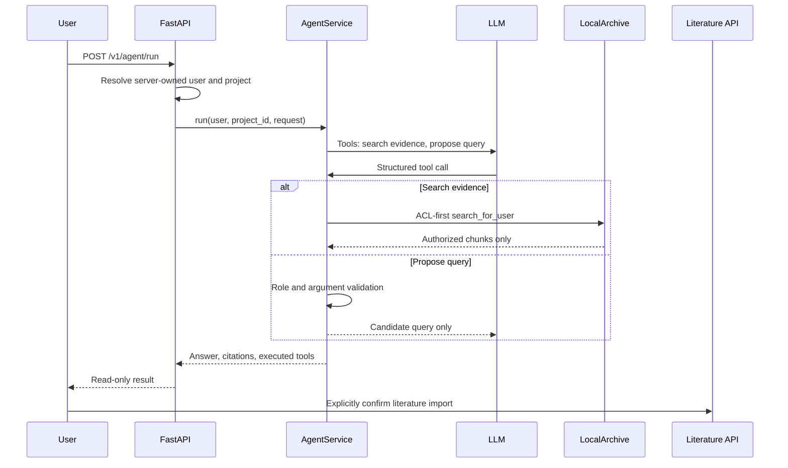

# 第十四章：受限工具调用 Agent 教程

_以 Lab Agent 当前实现为准：把模型用于低风险研究辅助，同时让权限、审批和写入仍由确定性服务掌控。_

---

## 🧭 目标与边界

本章实现的不是一个拥有任意系统权限的“万能 Agent”，而是一个可选的模型工具调用循环。模型只可在两个服务端工具中选择：检索当前用户已授权的证据，或生成 Europe PMC 候选检索式。

| 能力 | 是否交给模型选择 | 最终控制者 |
| --- | --- | --- |
| 搜索项目内已授权证据 | 是 | `LocalArchive.search_for_user()` 的 ACL-first 查询 |
| 生成候选文献检索式 | 是 | `research_direction_query()`、角色与长度校验 |
| 导入开放获取文献 | 否 | 独立 `/v1/literature/import` 接口与用户确认 |
| 报销审批或提交 | 否 | `LocalAdminAdapter` 的 preview/approve/confirm 状态机 |
| 论文流程状态推进 | 否 | `ManuscriptWorkflow` 的显式状态机和人工审核 |
| 项目可见性与角色判断 | 否 | `current_user()`、`can_execute_tool()`、归档 ACL |

> ⚠️ **安全原则：** 模型不是权限边界。它提交的是结构化工具意图；服务端才决定该工具是否存在、参数是否有效、用户是否有权访问，以及是否允许产生副作用。

## 🏗️ 请求如何流转



模型调用入口在 [app/services/agent.py](../app/services/agent.py)。`AgentService._tools()` 是唯一的工具注册点，定义了函数名和 JSON Schema；不要因为用户在提示词里要求“审批”或“直接下载”就动态添加工具。

## ⚙️ 配置与启动

本地演示默认不调用任何模型，因而不需要密钥。此时知识问题走确定性证据返回，研究方向走受控术语映射；响应中的 `model_used` 为 `false`。

启用模型前，在启动 API 的同一个终端设置凭据和模型名：

```bash
cd /GIT/scientific-agent-skills/lab-agent
export OPENAI_API_KEY='your-api-key'
export LAB_AGENT_OPENAI_MODEL='your-tool-calling-model'
uv run --no-sync uvicorn app.main:app --host 127.0.0.1 --port 8001
```

`AgentService` 仅在设置 `LAB_AGENT_OPENAI_MODEL` 时创建 `OpenAI()` 客户端。模型供应商和模型名是部署配置，不应写入代码、提交到仓库或放到浏览器变量中。

## 🔌 两项模型工具

### 检索授权证据

`search_authorized_evidence` 接收一个长度不超过 1000 的 `query`。服务端调用 `KnowledgeService.search_documents()`，它最终将 `user_id`、项目、活动状态、项目角色和文档 ACL 一起限制在 SQL 候选查询中。模型拿到的只有已授权片段和定位它们所需的 citation 数据。

服务端随后使用 `validate_citations()` 校验每一条 `(document_id, chunk_id)` 都存在于本轮检索结果。返回给客户端的引用来自服务器构造的 `Citation`，而不是模型自行编写的 ID。

### 生成候选检索式

`propose_literature_query` 接收 `direction`，先通过 `can_execute_tool()` 检查项目内的 `research-assistant` 或 `pi` 角色，再调用 `research_direction_query()` 生成可审计的 Europe PMC 查询。这个工具只返回 `candidate_query` 和 `requires_user_confirmation: true`；它不会下载、解析或入库。

前端流程因此分成两个明确动作：

1. 点击“生成候选检索式”，调用 `POST /v1/agent/run`，`mode` 为 `literature_query`
2. 用户检查候选查询后，点击“确认并导入开放全文”，调用独立的 `POST /v1/literature/import`

这使模型的低风险建议与知识库写入分离。即使模型输出不合适的方向，也不会在该轮调用中改变归档数据。

## 🧩 模型循环为什么有上限

首次模型调用使用 `tool_choice="required"`，强制它先请求一个已注册工具；后续调用使用 `"auto"`，允许它基于观察到的结果选择继续调用或直接作答。循环由 `MAX_TOOL_ROUNDS = 3` 限制。工具调用名、工具参数和观察结果都经过 `AgentService._execute_tool()`，未知工具始终返回拒绝结果。

当前实现适合短的检索与检索式生成任务。它还不是论文工作流的通用规划器，且未把真实 token、费用、时延或每次调用审计统一写入治理存储。需要扩展自主性时，应先补齐这些观测与预算边界，而不是简单提高轮数。

## 🧪 手工验证

默认降级模式下，使用 Research Assistant 演示身份测试候选检索式：

```bash
curl --fail --silent -X POST http://127.0.0.1:8001/v1/agent/run \
  -H 'Content-Type: application/json' \
  -H 'X-User-Id: research-demo' \
  --data '{"project_id":"mouse-neuro-demo","request":"小鼠海马神经发生与阿尔茨海默病","mode":"literature_query"}'
```

预期响应包含 `candidate_query`、`executed_tools: ["propose_literature_query"]` 和 `model_used: false`。设置模型配置后，`model_used` 应为 `true`；无论何种模式，响应都不应包含审批、提交或导入类工具。

回归检查：

```bash
uv run --no-sync pytest -q
uv run --no-sync ruff check app tests
cd web && npm run build
```

`tests/test_agent.py` 覆盖默认降级路径和模拟模型只能访问两个已注册工具的契约；`tests/test_api.py` 覆盖 `/v1/agent/run` 的 API 降级响应。

## 🔒 面试中应如实说明的范围

可以说：项目已接入受限的 LLM tool calling。模型可以在白名单内选择只读证据检索或候选检索式生成，服务端逐次执行 ACL、角色、参数与引用校验；导入还需用户显式确认。

不应说：模型可以自主完成论文审核、绕过审批提交报销，或已经具备生产级 ReAct 成本治理、多 Agent 协作和全链路模型审计。这些能力仍由确定性工作流控制，或尚未实现。

相关代码：[AgentService](../app/services/agent.py)、[API 入口](../app/main.py)、[知识服务](../app/services/knowledge.py)、[文献导入](../app/services/literature_import.py)、[Agent 测试](../tests/test_agent.py)。
