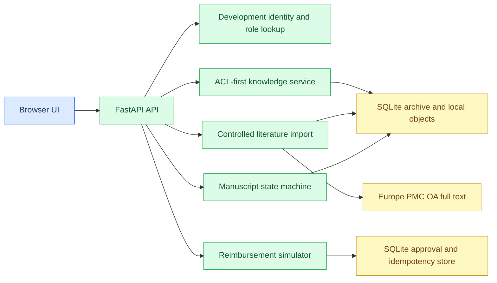
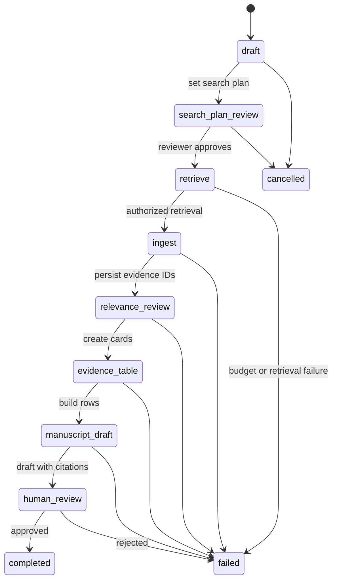
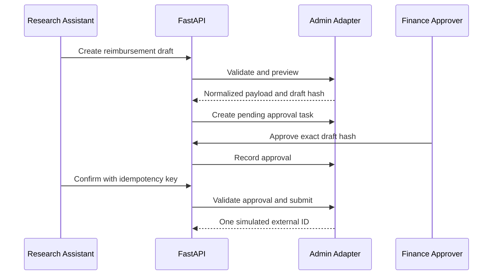
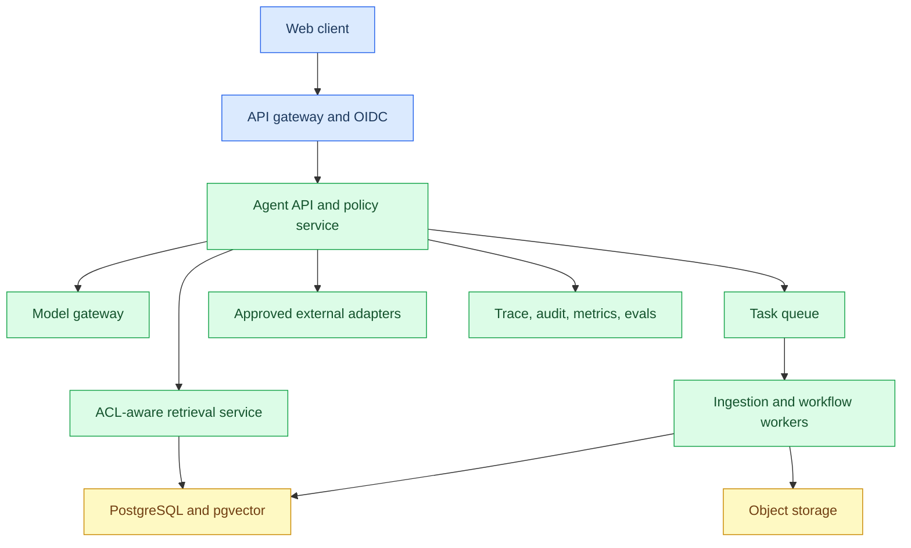

# Lab Agent 面试准备手册

本文以当前 `lab-agent` 代码、[完整使用手册](完整使用手册.md) 和仓库根目录的[面试问题精讲](../../docs/面试问题精讲.md)为依据。目标是帮助你针对 AI Agent 工程师、智能体应用开发和 Agent 平台工程师岗位，真实、清楚地讲解该项目。

不要把本地教学实现包装成生产系统。面试中的可信度来自于：准确说明已经交付的边界，能解释每一个设计选择，也能说清楚下一步如何补齐生产能力。

## 项目定位

**一句话版本：** Lab Agent 是一个面向神经医学实验室的本地教学型 Agent 应用。它把“受权限约束的知识检索、开放全文文献入库、论文证据工作流和报销审批模拟”实现为可测试的服务，而不是让模型直接访问文件系统、数据库或外部行政系统。

| 维度 | 当前实现 | 面试中应如何表述 |
| --- | --- | --- |
| 面向用户 | 实验室学生、研究助理、PI、财务审批人 | 医学科研与行政场景，用风险分级区分读、草稿、计算和外部写入 |
| 应用形态 | FastAPI + React 单页 + 本地 SQLite | 本地可演示垂直 Agent 应用，不是生产 SaaS |
| 知识来源 | HTML、PDF、DOCX、JATS XML；Europe PMC 开放全文 | 文档准入、去重、解析、ACL、chunk、引用是确定性链路 |
| 检索 | ACL-first SQLite 检索 + hash-v1 向量相似度 + 关键词 | 权限先于排序，回答只引用本轮已授权候选 |
| Agent 成分 | 受控研究方向导入、论文状态机、工具/审批服务 | 当前不是自由规划 LLM Agent；固定高风险流程优先写成状态机 |
| 外部写入 | 本地 SQLite 报销模拟器 | 已验证 preview -> approval -> commit -> idempotency 模式；未连接真实财务 API |
| 评测 | pytest、Ruff、发布门禁、红队输入、知识评测集 | 最近本地验收为 47 个测试通过；不声称线上 SLA 或真实用户指标 |

## 90 秒自我介绍

“我做的是一个面向神经医学实验室的 Lab Agent 学习项目，核心目标不是做一个能自由调用工具的聊天机器人，而是把科研知识、文献和行政流程放进可控边界里。

在知识侧，我实现了本地文档入库、SHA-256 去重、JATS/HTML/PDF/DOCX 解析、项目角色 ACL 和带文档/章节定位的回答。检索时先在 SQL 查询中按用户、项目和角色筛掉未授权 chunk，再进行关键词和向量评分，回答只能引用本轮授权候选。

在行动侧，我把论文生成做成有 checkpoint、预算和人工审核节点的状态机；把报销做成 preview、非申请人审批和带幂等键的提交模拟。最近还加入了研究方向助手：用户描述方向后，系统将其转为可审计的 Europe PMC 开放全文查询，下载、验证正文并入库。

这个项目当前是本地教学实现，我没有把 `X-User-Id`、SQLite 模拟器或确定性术语映射说成生产能力。若进入生产，我会优先补 OIDC、PostgreSQL/对象存储、异步队列、模型网关、真实适配器和可观测性。”

## 三分钟项目讲解

### 问题与目标

实验室常见需求有四类：查询 SOP 和论文、把开放文献收进本地知识库、整理证据形成论文草稿、检查或提交行政材料。这些任务的数据敏感度和副作用不同，所以不能用一个“万能 Agent”直接执行。

我按风险拆分：只读知识检索自动执行；论文和行政材料先生成草稿；受控写入必须预览、审批和幂等提交；动物操作、设备控制、支付和删除不自动化。

### 架构与主链路

请求进入 FastAPI 后，开发模式从 `X-User-Id` 获得本地身份，再由服务端的用户、项目和角色记录构造授权上下文。知识问答走 ACL-first 检索；方向导入只允许研究助理和 PI 执行；报销提交需要财务审批。浏览器不直连数据库、Europe PMC 或行政系统。

### 结果与证据

- 本地服务通过 `GET /health`、知识问答、SSE 引用、任务和审批 API 提供演示能力。
- 本地演示库已导入 100 篇神经医学开放全文；加上演示 SOP，最近一次运行统计为 101 篇文档、4,519 个 chunk。这个数字是当前环境快照，不应包装成覆盖全部领域的知识库。
- `tests/` 覆盖 ACL、越权、提示注入文本、入库去重、状态转换、预算、审批篡改、幂等、审计脱敏和 API 边界；最近验收为 47 项测试通过。

## 关键设计选择

### 为什么不是“直接接大模型聊天”

当前知识回答是抽取式、证据约束的 `KnowledgeService`，没有配置模型供应商密钥。这样做的目的不是回避模型，而是先验证高风险系统中更基础的契约：谁能检索什么、引用是否来自授权证据、写入如何审批、失败如何停止。

面试回答：

> 模型应作为受限组件，而不是权限边界。当前版本先把 ACL、引用校验、输入 allowlist、状态机、预算和审计放在模型之外。后续接入模型时，只允许它在经过 ACL 过滤的证据集合上生成答案，并在工具执行前继续经过服务端校验。

### 为什么本地实现选 SQLite

SQLite 让演示库、任务 checkpoint、审批模拟和审计可在单机离线运行，降低学习项目的启动成本。它不代表生产选型：多实例写入、并发 worker、行级隔离、向量检索扩展和审计保留应迁移到 PostgreSQL/pgvector、对象存储和队列。

### 为什么论文工作流用状态机

论文证据整理包含固定的审核关口：检索策略审核、受权检索、相关性卡片、证据表、草稿、人工审核。固定流程用显式状态机比 ReAct 循环更可复现、更可审计，也更容易恢复。

## 功能到代码证据映射

| 面试主题 | 实现位置 | 可以现场说明的证据 |
| --- | --- | --- |
| HTTP API 和本地身份 | `app/main.py` | `/v1/session`、`/v1/knowledge/query`、`/v1/literature/direction-import`、`/v1/actions/...` |
| 文档解析和 Europe PMC 下载 | `app/services/ingestion.py` | 仅收开放获取、有全文的 PMC；无正文候选写入 `skipped.jsonl` |
| 本地入库、去重、ACL | `app/services/local_archive.py` | SHA-256/标识符去重；`user_roles -> document_acl -> chunks` 前置过滤 |
| 回答与引用白名单 | `app/services/knowledge.py` | `validate_citations` 拒绝不在本轮检索结果里的引用 |
| 研究方向导入 | `app/services/literature_import.py` | 中文术语表或英文关键词生成可审计查询；每批上限 50/100 |
| 论文工作流 | `app/services/manuscript_workflow.py` | checkpoint、预算、人工审核、TODO 草稿、artifact 所有者校验 |
| 行政写入控制 | `app/services/admin_adapter.py` | 政策校验、preview hash、非申请人审批、幂等键、模拟外部 ID |
| 工具参数和发布门禁 | `app/services/release_gate.py`、`app/launch_report.py` | 拒绝路径穿越、SQL/Shell 片段、超大输入；检查测试、Ruff、评测数量 |
| 授权规则 | `app/core/authz.py`、`docs/access-matrix.md` | active、项目角色、工具 allowlist、审批数和自审限制 |
| 审计、预算和缓存 | `app/services/governance.py` | 敏感字段脱敏、payload hash、预算永久停止、缓存按用户/项目/角色隔离 |

## 高频问题与项目化回答

### Agent、工作流和 RAG 的边界

**问：这个项目到底是不是 Agent？**

答：它是一个 Agent 应用的基础实现，而不是自由规划型 Agent。项目内同时有三类能力：RAG 用于受权限约束的证据检索；状态机用于固定且高风险的论文/审批流程；研究方向导入提供受控的外部知识获取工具。当前没有接 LLM 规划器，所以不能声称已经实现 ReAct、多工具自主规划或模型驱动编排。

**问：为什么固定流程不用 Agent 自由规划？**

答：论文审核和报销提交的顺序本身是业务控制。让模型选择是否跳过审批没有收益，反而引入不可复现和越权风险。项目把可变部分限制在低风险的检索方向或未来的证据总结，把审批、提交和终止写成代码状态转换。

**问：如果加入 LLM，你会放在哪里？**

答：放在两个受约束位置：第一，基于方向描述生成候选检索式，但输出必须经过 schema、词表/策略和用户预览；第二，在 `KnowledgeService` 已返回的授权 chunk 集合上生成带引用回答。模型不能直接得到数据库连接、文件路径、角色字段或行政 API 凭据。

### RAG 与知识准入

**问：完整的知识入库链路是什么？**

答：文件准入先限制格式和 50 MiB 大小，拒绝可执行文件头；随后按格式解析标题、章节、页码或段落；计算 SHA-256 并按项目去重；复制原始对象；按语义段落 chunk，记录 section/page/paragraph；写入文档 ACL 和 chunk metadata；最后用 hash-v1 向量和关键词进行本地排序。对 Europe PMC，下载器额外限制开放获取、有全文的 PMC，并保存来源、许可和 hash。

**问：为什么先 ACL 再检索，而不是检索后过滤？**

答：后过滤可能把未授权内容带入召回、rerank、缓存、日志或模型上下文，造成侧信道泄露。这里 SQL 候选查询把 `users.active`、`user_roles`、`document_acl`、项目和文档状态一起限制，未授权 chunk 根本不进入排序。

**问：chunk 策略是什么？**

答：优先保留文档结构：JATS 使用章节和段落，HTML 通过标题和段落，PDF 用页码，DOCX 用段落。`chunk_sections` 只在语义片段过长时再切分，并把定位信息保留在 metadata 中。当前是可复现的 baseline，不宣称已经做过生产级 chunk 参数调优或 reranker A/B。

**问：如何减少幻觉和伪造引用？**

答：当前回答器直接返回排名第一的证据片段，引用由服务端构造；`validate_citations` 检查每个 `(document_id, chunk_id)` 都存在于本轮授权检索集。未来接 LLM 后也必须保留这个校验，不能信任模型自己编的引用。

**问：检索不到怎么办？**

答：返回 `insufficient_evidence` 并说明缺少已授权证据。不能把空结果解释成科学上的否定结论；需要引导用户调整问题、导入授权文献或申请权限。

### 工具调用与研究方向助手

**问：研究方向助手如何工作？**

答：网页将方向和 50/100 篇数量传到 `/v1/literature/direction-import`。服务端检查研究助理或 PI 的项目角色；`research_direction_query` 对英文关键词直接使用，对有限中文神经医学术语表做确定性扩展；随后固定添加 Europe PMC 的开放获取、全文、PMC 条件。下载后校验 JATS 是否有正文，记录 manifest/skipped 原因，并通过 `LocalArchive.ingest` 写入 ACL 和索引。

**问：为什么不是自然语言 Agent 直接抓网页？**

答：当前没有模型密钥，也不能把任意 URL 或 shell 权限暴露给聊天输入。受控工具只允许一个来源、一个资源类型、50/100 的明确上限和固定项目 ACL。对于未知中文方向，系统会要求英文关键词而不是假装理解。这是安全性和可审计性优先的取舍。

**问：工具接口要满足什么标准？**

答：单一职责、严格输入范围、服务端身份重新授权、机器可读结果、稳定错误和副作用标记。这里导入接口限定 `direction` 长度、项目 ID 和 50-100 上限；报销接口把 preview、审批和提交拆开；输入检查拒绝路径穿越、SQL/Shell 片段和超过 16 KiB 的参数。

**问：为什么需要幂等？**

答：Agent 或浏览器在超时后可能重试。`LocalAdminAdapter` 用唯一 `idempotency_key` 绑定任务和模拟外部请求，重复确认返回同一外部 ID，不会再次创建报销。生产中同样要把该 key 传给真实 API 并保存请求-结果映射。

### 审批、状态和恢复

**问：报销写入路径如何避免越权？**

答：先服务端授权，再校验字段、金额上限和凭证；将规范化 payload 计算 `draft_hash`；创建 `pending_approval` 任务；财务审批人或管理员对该 hash 审批；提交时再次核验任务状态、申请人与审批人不同、审批未过期、没有拒绝和幂等键。任何一个条件不满足即拒绝。

**问：论文工作流如何恢复？**

答：每次状态转换将 payload 写入 SQLite checkpoint，`resume(workflow_id)` 返回最后状态。工作流包含最大步骤、token、成本和 deadline；超出任一预算会进入 `failed`，而不是无限重试。生产版会将 checkpoint、artifact 和队列状态放到 PostgreSQL/对象存储，并为长任务提供 task ID。

**问：哪些状态是终态？**

答：论文工作流的 `completed`、`failed`、`cancelled` 是终态。只有到 `human_review` 后，审核人批准才能完成；拒绝转为失败。终态防止后续节点再次写入草稿或重复提交。

### 安全、隐私与合规

**问：如何处理 prompt injection？**

答：文档中的“忽略此前指令”等内容被当作普通证据文本，不能改变服务端权限或工具集合。项目的测试会把注入文本入库并验证它只作为带引用的结果出现。根本防线是服务端 ACL、固定工具 schema、最小权限、审批和回归测试，而不是单靠提示词。

**问：如何防止跨项目知识泄露？**

答：用户必须 active，并拥有目标项目角色；SQL 在候选阶段关联项目角色和文档 ACL；无权用户和跨项目用户均得到 `insufficient_evidence`。缓存治理模块也使用用户、项目和角色作为隔离键。当前开发头 `X-User-Id` 只用于本地演示，生产必须换成 OIDC claims 加数据库策略。

**问：日志记录什么，如何不泄露敏感内容？**

答：`GovernanceStore` 记录 request/trace、actor、角色、项目、工具版本、参数摘要、检索 document ID、审批、外部 ID、延迟、成本、错误和终态。token、password、secret、receipt 等字段会脱敏；全文和 payload 只记录 SHA-256 与长度。生产还需要加密、保留期限、访问审计和数据分类。

### 评测、可靠性与可观测性

**问：你怎么验证项目质量？**

答：单元和 API 测试覆盖关键契约，`release-check` 验证路径穿越、预算停止、checkpoint 恢复和评测集数量；`launch-report` 聚合 pytest、Ruff、SQL/Shell/超大输入红队、金额阈值和最小权限上线顺序。最近本地结果为 47 个测试通过，知识评测集 30 条。它说明回归边界被覆盖，不等价于真实生产可用性证明。

**问：为什么没有把导入放进 Redis/RQ？**

答：这是当前明确的缺口。100 篇全文下载是长任务，当前同步 HTTP 可能占用连接数分钟。生产版本应在 API 只创建任务和返回 task ID，由 RQ/Celery/工作流 worker 执行下载、checkpoint、重试、进度事件和取消；前端轮询或 SSE 订阅任务状态。

**问：当前监控有哪些不足？**

答：有本地审计字段、预算和发布报告，但没有 OpenTelemetry exporter、集中 trace、指标存储、告警、P95/SLO 或线上成本看板。下一步会将 trace ID 贯穿 API、检索、工具和 worker，并按模型/工具/版本看成功率、拒答率、时延、成本和人工接管。

## 系统设计题：从本地 Lab Agent 扩展到 1,000 人

### 澄清问题

先问：组织/项目数、文档规模与增量、敏感级别、读写 QPS、可接受延迟、是否接入现有 OIDC、外部系统 API 是否支持幂等、审计保留年限、预算、区域与合规要求。

### 推荐架构

| 层 | 生产改造 | 保留的项目原则 |
| --- | --- | --- |
| 身份 | OIDC 验证 JWT，服务端同步组织/项目角色 | 不信任客户端角色或模型声明的权限 |
| 数据 | PostgreSQL + pgvector、对象存储、迁移、备份 | 文档、chunk、ACL、审计均按租户/项目隔离 |
| 检索 | FTS + vector + reranker，检索前做 ACL | 未授权内容不得进入 rerank、模型上下文或缓存 |
| Agent | 模型网关、结构化 tool calling、节点图编排 | 固定高风险流程仍使用确定性状态机 |
| 长任务 | 队列、幂等任务、worker、checkpoint、取消 | 下载和解析有预算、失败原因和可恢复状态 |
| 外部写入 | OAuth scope、批准的 API adapter、回查状态 | preview -> approval -> commit，幂等与审计不变 |
| 观测 | OTel trace、指标、日志、在线反馈和评测 | 记录版本、成本、延迟、错误和终态；日志脱敏 |

### 读路径回答模板

“读取请求先验证 OIDC，并从服务端加载组织、项目、角色和数据分级。检索服务在 SQL/向量候选层强制 ACL，随后做混合召回和 rerank。模型只获取少量已授权证据和引用 ID；证据不足时拒答或澄清。最终记录 trace、检索 ID、模型/工具版本、延迟和成本。”

### 写路径回答模板

“模型只能生成结构化草稿。服务端校验 schema、业务规则、项目权限和影响范围，返回 preview；用户确认后创建审批任务；审批绑定草稿 hash；worker 用幂等键调用批准的外部 API，并回查最终状态。失败要区分可重试网络错误、不可重试权限错误和人工处理冲突。”

## 面试中必须主动说明的限制

| 当前限制 | 正确表述 | 下一步方案 |
| --- | --- | --- |
| 没有 OIDC | `X-User-Id` 是开发身份选择器，不能部署到公网 | OIDC JWT 校验、服务端角色同步、会话和撤销 |
| 没有真实 LLM 编排 | 当前回答是抽取式，方向助手是确定性术语扩展 | 模型网关 + 结构化输出 + 证据/工具服务端校验 |
| 本地 SQLite | 适合单机演示和确定性测试 | PostgreSQL/pgvector、对象存储、备份、迁移 |
| 同步论文下载 | 当前 50/100 篇导入会占用 HTTP 请求 | 队列、task ID、进度、取消、指数退避 |
| 真实财务未接入 | 报销适配器仅模拟外部系统 | 合规 API、OAuth scope、回查、补偿和人工异常队列 |
| hash-v1 向量 | 作为无模型依赖的确定性 baseline | 评测后替换 embedding/reranker，并对版本回归 |
| 中文方向覆盖有限 | 只支持显式术语表或英文关键词 | 经批准的模型翻译/查询规划，增加 query 审核与评测 |

## 简历项目表述

**简历一行版：**

> 开发面向神经医学实验室的本地 Lab Agent：实现 ACL-first 文档检索与引用校验、Europe PMC 开放全文受控入库、可恢复论文证据工作流，以及 preview/审批/幂等的报销模拟；以 pytest、Ruff 和红队门禁保障关键安全契约。

**项目详情版：**

- 使用 FastAPI、React 和 SQLite 构建本地可运行应用，支持文档入库、角色授权、带定位引用的问答、研究方向驱动的开放论文扩充和任务展示。
- 构建文档准入链路：格式/大小限制、JATS/HTML/PDF/DOCX 解析、SHA-256/标识符去重、章节级 chunk 与来源/许可清单。
- 实现 ACL-first SQL 候选过滤和引用白名单校验，覆盖跨项目、停用用户、伪造引用和提示注入文本场景。
- 设计论文状态机和行政写入控制：checkpoint、预算、人工审核、draft hash、非申请人审批和 idempotency key。
- 编写 47 项自动化测试及发布门禁；请在投递前重新运行并按实际结果更新该数字。

## 追问演练清单

每题先在 60-90 秒内回答，再追问到代码级别。

1. 你为什么把这个项目称为 Agent，而不是 RAG？
2. 画出知识问答的完整请求路径，ACL 在哪一层生效？
3. 文档里有 prompt injection 时系统发生什么？
4. 为什么引用校验必须在服务端进行？
5. 为什么 `X-User-Id` 不能进入生产？
6. 如何证明同一报销不会提交两次？
7. `draft_hash` 防的是什么攻击或业务错误？
8. 审批人能否审批自己的任务？代码在哪里阻止？
9. 工作流如何处理 deadline、成本和步骤耗尽？
10. 为什么论文草稿保留 `TODO`，而不是自动补全文？
11. 100 篇论文下载失败一篇时如何处理？
12. Europe PMC 标记开放获取但没有正文时如何处理？
13. 为什么导入必须保存 manifest、license 和 SHA-256？
14. hash-v1 向量有什么优点和局限？
15. 如何换成真实 embedding 模型且不破坏已有索引？
16. 当前检索为何可能回答过长，如何改进？
17. 如何将同步导入改成异步队列？
18. 任务重试和幂等如何配合？
19. 多项目/多租户下缓存 key 应包含什么？
20. 如何做知识库权限变更后的缓存失效？
21. 真实行政 API 超时后如何判断是否已提交？
22. 如果外部 API 不支持幂等键怎么办？
23. 你会为模型工具调用记录哪些 trace 字段？
24. 如何定义知识问答和写入任务的 SLO？
25. 如何构建并持续维护红队与回归评测集？
26. 什么情况下应拒绝而不是自动化？
27. 如何加入 MCP，但不让 MCP 绕过现有授权？
28. 多 Agent 在这个项目中是否必要？为什么？
29. 方向助手为何不是“真正理解任何中文”的 Agent？
30. 给你两周时间，你会优先上线哪些生产能力？

## 面试前最后检查

- 在面试前重新运行 `.venv/bin/python -m pytest -q`、`.venv/bin/python -m ruff check app tests` 和 `launch-report`，只报最新真实结果。
- 浏览器现场演示顺序：知识问答 -> 检查引用 -> 展示研究方向助手 -> 说明 50/100 篇导入是长任务 -> 展示模拟报销审批，而不是声称真实财务提交。
- 准备一个跨项目拒答、一个学生无权导入、一个审批前提交被拒绝的例子。
- 任何“线上 QPS、真实成本、模型效果、真实机构用户、真实财务对接”问题，若没有证据，一律说明尚未测量或尚未接入。
- 准备白板图：认证/ACL、检索、工具、审批、队列、审计六层。先讲边界，再讲技术选型。

## 反问面试官

1. 团队当前的 Agent 任务是探索型还是固定业务流程型？高风险工具的审批策略是什么？
2. 生产系统如何管理模型、prompt、工具 schema 和评测集的版本？
3. RAG 的权限过滤在索引、召回和缓存哪些层强制？
4. 团队是否已有模型网关、trace 平台和离线评测基线？工程师负责到什么深度？
5. Agent 的成功率、人工接管率、成本和时延目前如何度量？
6. 哪些外部系统是写入目标，它们是否支持幂等、回查和测试环境？
7. 团队遇到过最难的安全或可靠性故障是什么，复盘后改变了哪些工程规范？

## 参考材料

- [完整使用手册](完整使用手册.md)：当前可运行功能和操作边界。
- [权限矩阵](access-matrix.md)：项目角色、读取和写入规则。
- [数据库与迁移](database-and-migrations.md)：PostgreSQL/pgvector 目标架构的本地说明。
- [面试问题精讲](../../docs/面试问题精讲.md)：Agent 工程师通用能力地图与问题框架。
